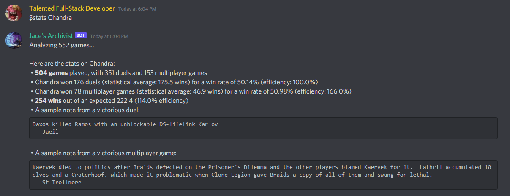

# The Archivist
## *A discord bot for cataloguing your EDH victories*

## Introduction

For the past couple years, my friends and I have engaged in semiregular games of Magic: the Gathering.  Being both competitive and passive-aggressive sorts of people, it is imperative that we know at any given moment whether someone deserves to die for their previous victories.  Fed up with silver tongues and motivated reasoning, we turned to spreadsheets.  The Archivist is the culmination of that project: an automated one-stop shop for data collection, retrieval, and analysis.  You too can partake of statistically justified retribution!

## Installation

### Dependencies
First, install python dependencies by opening a terminal in the project folder and typing:
> pip3 install -r requirements.txt

### Bot token
We need to create a new file called "config.py" in the project directory.  The bot token is the first of three values we'll be adding.  If you haven't done this before, you can follow [this guide](https://discordpy.readthedocs.io/en/latest/discord.html) on how to create a bot account with Discord.  

**When assigning permissions:** At this time, minimum required permissions are the "bot" scope and the View Channels, Read Message History, and Send Messages permissions.

Once you've finished setting up permissions, head over to the **Bot** tab and copy the bot's token.  **Do not share this token with anyone, as it can be used to turn your bot against you.**  We will add the token to config.py like so:

> `bot_token = 'bot token here'`

### Output channel and admin id

To complete setup, we need to assign an admin and pick a channel for the bot to post in.  To do that, we need id numbers.  The easiest way to get those is to start the bot with `py -3 main.py`.  (There'll be some errors, but don't worry, we're about to fix those). The bot logs information about all incoming messages to the console as long as they begin with a "\$", so send a message starting with "\$" in the channel you want the bot to post in.

You can find the id of the channel in the 'channel' term (second, after Message) and your account id in the 'author' term.  Enter them into config.py like so:

> `game_channel_id = channel id here`

> `admin_id = account id here`

And that's it!  Restart the bot and you're good to go!

## Features

The Archivist has three main feature families: a set of in-game commands to record data, a statistics engine to analyze previous games, and a data manager to mess with the database.  In the current version, commands can be entered in any channel, but output tends to go to the channel whose id is specified in config.py.  (The bot currently replies to stats commands in the channel the command was sent to.)

(A note on notation in this readme: square brackets ( '[' and ']' ) denote *terms to be replaced,* e.g. if the readme tells you a command is `$stats player=[name]`, then a search for player Bob would be typed `$stats player=Bob`, *without brackets.*)

### Game tracking

TL;DR, The Archivist allows you to track games played with your friends and save them to a persistant location for later analysis or bragging rights.

1. Game tracking is now relative to one or more *lobbies*, which can be joined with `$join` or `$join [lobby]`.  To use a lobby, players create an alias which will be associated with their database information using the `$register [alias]` command.  Archivist maintains a list of aliases linked to Discord user ids, meaning aliases persist across sessions.  Lobby assignment does *not* persist across sessions.
2. Once in a lobby, players can use the `$cmdr [name of commander]` command to add themselves to the game with that particular commander.  If you want to use Archivist for a non-EDH (or even non-MtG) format, you can just put a name for your deck instead.  Archivist considers the game to have started once you choose a player to go first with `$first [alias]`. You can optionally record who dies first with `$game elim` followed by the player's name.
3. Declaring a winner  (`$winner [alias]`) gives all players the opportunity to leave notes for posterity with `$note [an arbitrarily long explanation of why you definitely should have won that game if not for those meddling kids]`.
4. Finally, `$end` saves the game data to the database and clears it from the active game slot.
5. You can type `$status` at any point to get information on the game in the lobby you're currently assigned to.  `$cancel` will close out the game without saving information.

*Note how the game status strikes out Liliana because the table killed her first (the fate of all Sen Triplets players)*

### Stats Engine

The stats engine lets you retrieve and analyze game data.  Stats commands begin with `$stats` followed by a command and any number of filter terms.

#### **Commands**

All commands are executed using a sample set of saved games, defined by user-provided filters (discussed below).  If no filters are provided, the stats engine will use all of the games in its database.

* `games` returns the the total number of games in the sample set
* `players` returns the number of games each player has participated in
* `wins` returns each player's win record
* `elims` returns the number of times each player was eliminated early during a game.
* `cmdrs` returns the number of times each player has played a given deck
* `notes` returns a (limited) number of summaries from the sample set
* Using a player's name as a command returns a breakdown of their win-loss record compared to chance.

*The Archivist's player statistics distinguishes between 'duels' (1v1 games) and multiplayer games, since some players (like me) have a different threat level once political options are on the table.  As a side note, I was really proud of that Braids win.*

#### **Filters**

You can modify stats queries using an arbitrary number of filter terms.  Filter terms should be separated by spaces, and usually consist of a filter term, and operator, and one or more arguments (e.g. `$stats players win=Jace index=1;50`).  Some filters can be inverted with "-" to instead remove games that match the filter from the sample set.

Archivist does not currently support entering the same filter multiple times in a single query; instead, you can pass multiple arguments to some filters by separating them with a semicolon, e.g. `stats games pod=2;3` will narrow the sample set to games with 2 or 3 players.

The following filters modify the sample set:

* `player=[player name]` returns games where the specified player participated.  `player` can be inverted with `-` and accepts multiple arguments.  `!player=` is a more specific filter that returns games where the player list exactly matches the names provided.
* `cmdr=[name of commander]` returns games where the specified commander participated.  Like with `player`, it accepts the `-` and `!` prefixes and accepts multiple arguments.
* `win=[player or commander name]` returns games where the specified player or commander won.  It can be inverted with `-` and accepts multiple arguments.
* `pod=[int]` returns games where the number of players matches the the argument.  `pod` can be inverted with `-` and used with `<` and `>` inequalities—e.g. `-pod>3` filters out games with more players than 3.
* `index=[int]` filters the sample set based on the game's index in the database.  It can be used with `<`, `<=`, `>=`, and `>` inequalities.  You can define a range of indices by passing multiple values with a `=` operator, e.g. `index=1;10` returns the first ten games in the database.  `index` starts counting at 1, so `index=0` won't do anything.
* `recent=[int]` filters the sample set to the [int] most recent games; e.g. a command with `recent=10` will only analyze the last ten games.  `recent` can be inverted with the `-` prefix.

Player names can be used as filters.  These filters can accept multiple arguments but do not currently accept prefixes:.

* `[player]=[commander]` returns games where the player played that specific deck.
* `[player]=win` returns games where the player won.
* `[player]=elim` returns games where the player was eliminated early.
* `[player]=lose` returns games where the player did not win.
* `[player]=first` returns games where the player went first.

Some filters affect how and which information is presented and are only implemented for some commands:

* `limit=[int]` tells the bot how many entries to display.
* `sort=[argument]` tells the bot how to order results.  `sort` currently accepts `rand` (randomized) and `desc` (descending order, or lowest to highest) as arguments.  (There is no term for ascending order because it is the default)  Sort is currently implemented only for the `win` command.
* `display=[player]` only displays entries relating to the named players.

*An example using filter terms to compare how going first affects the win distribution for my brother's Ramos deck.*

Since you probably don't have MtG game data just lying around, I've included our group's file.  To get started, drop it into the main project folder and rename it to `gamehistory.txt`.  I've also included an algorithm for converting game spreadsheets into the game history storage format used by The Archivist.

### Data Manager

The data manager (DM) is a data sanitization tool mainly used to combat typos and inconsistencies.  (e.g. my Patron of the Moon deck at one point was stored as 'Patron', 'PatronMoon', and 'PatronOfTheMoon' across multiple games, causing the stats engine to think it was actually three different decks).  While the DM shares some features with the stats engine, there is no data contamination between the two (e.g. filter terms don't affect the data manager).  The DM is accessed through the `$data` command and access is locked to the user whose id is identified in config.py as the admin.

* Begin using the data manager by typing `$data load`.  This automatically pulls data from the game history file and backs it up to backup.txt.
* Once data is loaded, you can fuzzy search for terms using `$data fuzz [player or cmdr] [name]` to find all variations of a term in the database.  (The Archivist will also give you the closest rejected matches in case it missed something, but I think right now it's erring on the side of being too generous with the fuzzy search.)
* The DM is currently able to rename player and deck names.  This is done with the `$data rename [player or cmdr] [old name] > [new name]` command.  You can rename multiple targets at once by separating them with the | character, eg:
`$data rename cmdr Nikusar | Nekuzar | Necusar > Nekusar`
    * *All terms and operators must be separated by spaces*
* Once you are satisfied with your changes, you can save them to a text file of your choice with `$data save [destination]`.  The bot's game history is stored in gamehistory.txt by default. **Warning: The save command currently overwrites the destination file without giving any warnings.  Be judicious with your terrible powers.**
* If you're not happy with the changes you've made to the dataset, you can use `$data unload` to clear the DM.
* Changes made to gamehistory.txt won't be reflected in the stats engine until you refresh the stats with `$stats refresh`

*An example of fuzzy search in action.  We can see that my brother's Kozilek deck has been entered both under the complete name and the short name.  To make sure the statistics are as complete as possible, we'd want to choose one or the other and use the rename function.*

*An example of how to use the rename method.  One future development goal is the ability to read the complete log; discord only allows 2000 characters per message*

## Dependencies:

The Archivist owes its existence to discord.py.  Fuzzy search was implemented using the fuzzywuzzy library.

## Planned Future Development:

* Refactoring stats menthods to make display filters consistent across all methods
* Lobby method to predict each player's chance of victory in an ongoing game
* A reminder function that messages the Discord server *so people stop forgetting it's game time, Josh*
* Advanced statistical methods that e.g. calculate the impact of a specific deck's presence to your victory chances
* 'confirm action' checks for the scarier data manager methods

## Credits:
* Big thanks to [Jaculabilis](https://github.com/Jaculabilis) for tirelessly recording game data from 2017-2019, and for answering my Python questions.